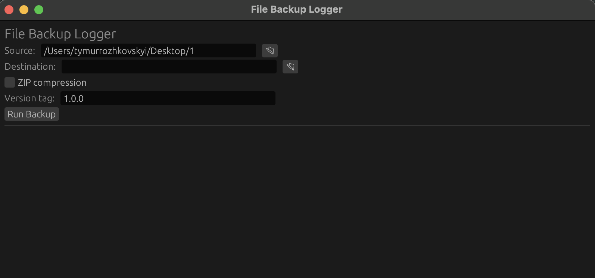
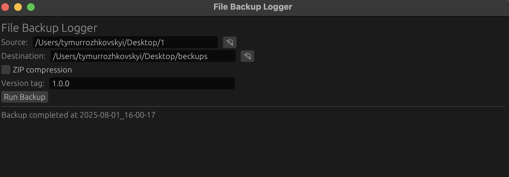
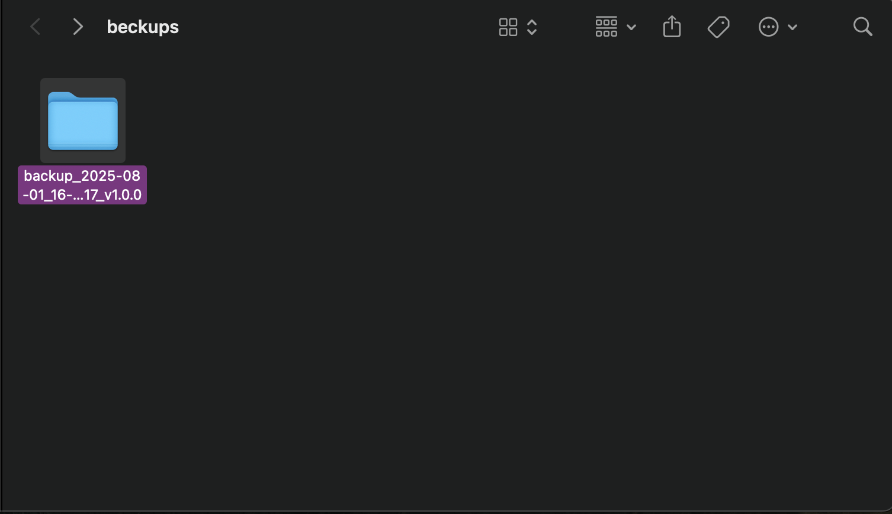
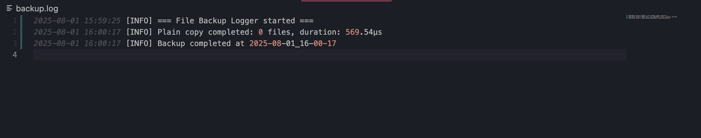

# File Backup Logger (Rust)

A simple desktop app to back up folders with versioning, optional ZIP compression, logging, GUI interface, and saved settings.

## Features

- Folder-to-folder backup
- Optional ZIP compression
- Timestamped & versioned folder names
- Log file with time, file count, duration
- GUI
- Config saved in JSON

## Screenshots

- Main GUI: 
- Backup complete:  
- Log file: 

## Getting Started

### 1. Clone & Build

```bash
git clone https://github.com/yourusername/file-backup-logger.git
cd file-backup-logger
cargo run
```

## How to get started:

- Select source and destination folders
- Optionally enable ZIP compression
- Enter version tag (e.g., 1.2.0)
- Click Run Backup

Result: A folder (or .zip) named like
backup_2025-08-01_15-42-12_v1.2.0 is created in the destination

##Logs

File backup.log is created next to the binary.
```bash
2025-08-01 15:42:13 [INFO] ZIP backup completed: 125 files, duration: 2.4s
```
